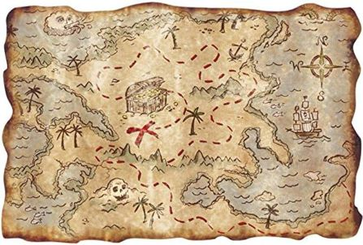

# Map-Project

</a>

Welcome to Travel-Map, Social Networking Platform: A unique network centered around travel experiences.
an open-source web application that provides you with the ability to travel, pin your location and share your reviews with other users.
Personal Travel Insights: Share and discover recommendations based on real experiences.
Community-Driven Recommendations: Like/dislike feature to gauge popularity of destinations.
Trip Inspiration Source: Ideal for finding new travel spots or sharing hidden gems.
Technologies Used: React.js, MongoDB, Mapbox, react-map-gl.
Development Focus: Combines front-end and back-end web development skills.
Programming Language: Leveraging JavaScript and Node.js for a seamless experience. CSS for the view.

## Table of Contents

- [Overview](#overview)
- [Technology Stack](#technology-stack)
- [Features](#features)
- [Getting Started](#getting-started)
- [Environment Variable](#environment-variable)
- [Usage](#usage)

## Overview

I have a strong passion for exploring and gathering experiences in different corners of the globe. Motivated by this desire, I chose to create Travel-Map, catering to fellow travel enthusiasts or those aspiring to embark on their journeys for the first time. This app allows users to record the locations they have visited, provide ratings and save them for future reference. A trip map can be used as a personal database for users to recall their travel experiences, but most importantly, Va allows the ability to share the memories and ideas for these trips and experiences with others :)

### Technology Stack

- **Frontend:** 

- **Backen:**

- **view:** 

### Features

- **enrollment** 

- **entry/exit** 

- **Adding a new location** 

- **Location viewing** 

## Getting Started

**install locally:**

## Environment Variable

## Usage

